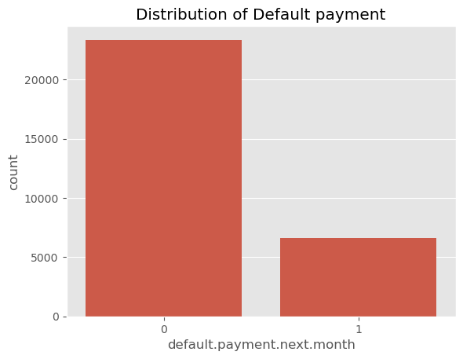
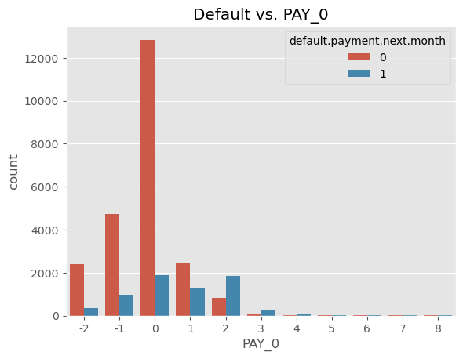
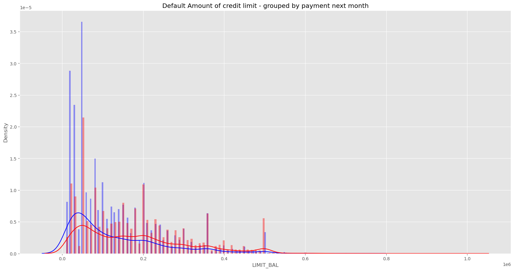

# Credit Risk Assessment

A machine learning web application that predicts whether a credit card customer is likely to default on their next payment.

## Overview

This project uses the [UCI Credit Card Default dataset](https://archive.ics.uci.edu/ml/datasets/default+of+credit+card+clients) (30,000 records) to train a Logistic Regression model and serves predictions through a Flask web interface.

**Model accuracy: 81%**

## Features

The model takes the following inputs to make a prediction:

- **Basic info**: credit limit, age, gender, education level, marital status
- **Payment status**: repayment status for the past 6 months (April–September)
- **Bill statements**: monthly bill amounts for the past 6 months
- **Previous payments**: monthly payment amounts for the past 6 months

## Tech Stack

- **Backend**: Python, Flask
- **ML**: scikit-learn (Logistic Regression), pandas
- **Frontend**: HTML, Bootstrap 4
- **Model persistence**: pickle

## Project Structure

```
credit_card/
├── app.py                                      # Flask application
├── model.pkl                                   # Pre-trained model
├── UCI_Credit_Card.csv                         # Dataset
├── Credit Card Default Prediction.ipynb        # EDA & model training
├── assets/                                     # README images
└── templates/
    └── index.html                              # Web UI
```

## Getting Started

1. Clone the repository
   ```bash
   git clone https://github.com/tramtran-helen/credit-risk-assessment.git
   cd credit-risk-assessment/credit_card
   ```

2. Install dependencies
   ```bash
   pip install flask pandas scikit-learn
   ```

3. Run the app
   ```bash
   python app.py
   ```

4. Open `http://localhost:5001` in your browser

## Exploratory Data Analysis

### Class Distribution
The dataset is imbalanced — ~78% of customers did not default, ~22% did. This context is important for interpreting model precision and recall.



### Payment Status vs. Default
September payment status (PAY_0) is the strongest predictor. Customers with delays of 2+ months have significantly higher default rates.



### Credit Limit by Default
Customers with lower credit limits default more — the default group (blue) peaks at lower balances compared to the non-default group (red).



## Model Performance

| Metric       | No Default (0) | Default (1) |
|--------------|----------------|-------------|
| Precision    | 0.82           | 0.69        |
| Recall       | 0.97           | 0.24        |
| F1-score     | 0.89           | 0.35        |
| **Accuracy** | **0.81**       |             |
